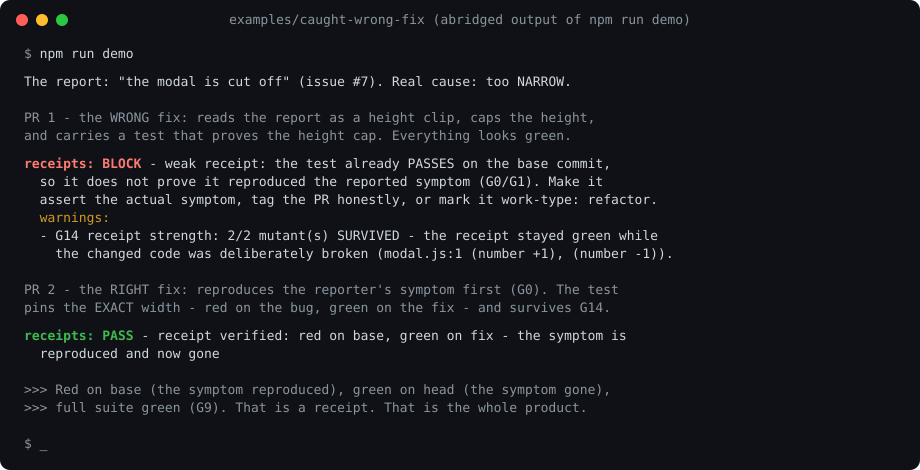

# receipts

[](https://www.npmjs.com/package/receipts-cli)
[](https://github.com/shaheershoaib/receipts/actions/workflows/ci.yml)

**Agents need receipts.** Your coding agent just said it fixed the bug. receipts re-runs the
proof before you trust it: the reported symptom's own acceptance test, red before the fix and
green after, on the build that carries the commit. An agent can type "Fixed"; it cannot fake
the symptom still being there when the test re-runs.



That is `npm run demo`: a real "modal is cut off" report, a plausible fix on the wrong axis (a
height cap) that would ship with every check green, and the enforcer refusing it because its
test already passed on the buggy code. The right fix carries a test that is red on the bug and
green after, and passes.

## What you get

- **A Claude Code plugin** that teaches the agent the discipline (the `gates` skill), stops it
  at the risky moment (a commit with no test run since the last edit; editing a test it just saw
  failing), blocks a "fixed" close-out that has no deployed-build evidence, and remembers what
  was tried on each surface across sessions. Enforcement is opt-in per repo: it starts the
  moment `receipts init` writes a config and stays off everywhere else.
- **A CI enforcer** (a GitHub Action; a CLI for anywhere else) that re-runs a PR's receipt red on
  base and green on head, runs the full suite, and then breaks the changed lines on purpose to
  prove the receipt has teeth.
- **The Gates**, a versioned standard (`receipts/gates@1.5`, twenty gates G0-G19 in
  [spec/GATES.md](spec/GATES.md)), each written down because skipping it shipped a wrong fix at
  least once.
- **An honesty ladder** instead of a wall: `fixed` is the only success; `unverified-reasoned`,
  `speculative` and `reverted` are tracked outcomes that ship without being counted as fixes.

## Install

1. **Add the plugin**, then restart the session (skills, hooks and the memory server load at
   session start):

   ```bash
   claude plugin marketplace add shaheershoaib/receipts
   claude plugin install receipts@receipts
   ```

2. **Set up the repo.** Ask the agent to "set up receipts here": the `setup` skill detects the
   stack and deploy target, asks you the four things detection cannot know (how an agent signs
   in, any dev bypass, whether the data is realistic, which surfaces need a browser), and writes
   `receipts.config.json`. Or run it yourself:

   ```bash
   npx receipts-cli init
   ```

   From here the tripwires and the Stop gate are on for this repo. They prompt you by default
   and deny under CI; `agent.tripwires` in the config picks `deny`, `ask`, `warn` or `off` per
   guard.

3. **Enforce at the PR.** Add `.github/workflows/receipts.yml`:

   ```yaml
   on: pull_request
   jobs:
     receipts:
       runs-on: ubuntu-latest
       steps:
         - uses: actions/checkout@v4
           with: { fetch-depth: 0 }
         - uses: actions/setup-node@v4   # plus your dependency install
         - uses: shaheershoaib/receipts/enforcer@main
   ```

   A PR that says `closes #N` must carry a test that fails on main and passes on the branch, or
   an honest downgrade tag. Full template: [enforcer/example-workflow.yml](enforcer/example-workflow.yml).

Codex, Cursor and any other AGENTS.md reader get the same discipline: `init` writes a short
block into `AGENTS.md` and the full gates into `.receipts/gates.md`.

## How it works

The gates split into **verify gates** (did you prove it works: reproduce first, assert the
value, the right build, full-scope green, do not shoot the referee, the receipt must exercise
the diff and have teeth) and **target gates** (did you fix the right thing: the exact flow, the
surface the reporter sees, the twins, the dependents, a fresh base, the deploy window, the
cause rather than the alarm). The enforcer re-runs the verify gates at the PR; the target gates
live in the agent's loop. [docs/how-it-works.md](docs/how-it-works.md) has the full table, how
each piece activates, the hotfix playbook and what the gates do not defend against.

| | |
|---|---|
| Standard | [spec/GATES.md](spec/GATES.md), plus the receipt and live-receipt schemas |
| Enforcer and CLI | [enforcer/](enforcer/); `npx receipts-cli` with `init`, `doctor`, `verify`, `observe`, `replay`, `explain`, `lock`, `report`, `kb` |
| Plugin | [plugin/](plugin/): the `gates` and `setup` skills, Stop / PreToolUse / SessionStart hooks, the `trajectory-kb` memory server |
| Measured | every PR runs the enforcer's self-verification suite, the hook suite, a weak-agent bench (0 undeclared escapes, 0 false blocks) and a real `claude plugin install`; the enforcer gates this repo's own PRs |

## Contributing and releasing

[CONTRIBUTING.md](CONTRIBUTING.md) covers the layout, the suites and the PR contract;
[docs/releasing.md](docs/releasing.md) is for maintainers.

## License

Apache 2.0. Use it, ship it, sell what you build with it; keep the `NOTICE` file with a
redistribution, and do not market a fork as `receipts`.
